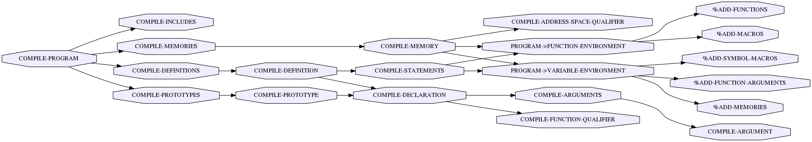

# setting up a kernel module

``` common-lisp
(define-program p)
```

This sets up a program instance, which corresponds to a compilation
unit given to CREATE-PROGRAM-WITH-SOURCE. In other words, one program
corresponds to an OpenCL C source file. Nope, there are not files, they are just
lisp strings. But you know, they are sort of files.

``` common-lisp
(in-program p)
```

This sets the value of *program* to the program `p`.

# kernel function

Now let's take a look at an example kernel function.

``` common-lisp
(defkernel vec-add-kernel (void ((a float*) (b float*) (c float*)))
  (let ((i (get-global-id 0)))
    (set (aref c i)
         (+ (aref a i) (aref b i)))))
```

I first describe what this kernel actually does (although it is already intuitive).
This is a function that takes three float arrays (pointers).
`(get-global-id 0)` returns the unique global work-item ID on dimension 0 assigned to each thread.
(Note that there is global id, local id, group id. See the OpenCL reference.)
Thus, if you run the kernel, N=`(get-global-size 0)` elements of the vector `c` gets updated.

Next I describe how this kernel is processed.
The kernel function `vec-add-kernel` is registered to the program `p`.
Macro expansion happens at this point, however this is still an S-exp, not the C code string.
It really becomes a C code string when a function `compile-program` gets called.

``` common-lisp
(compile-program (find-program 'p))
```

This function returns an OpenCL C source code string, assembling every global
variables and kernel functions defined in the program.

Compiling this C code into a device-specific binary is a different story and it
requires the involved explanation of OpenCL framework
(CREATE-PROGRAM-WITH-SOURCE). This is clearly out of scope of this document.
Instead, we describe how the S-expression is compiled into a C source code.

# C code compilation process

Gotcha! I don't describe it. Call graph should suffice!


